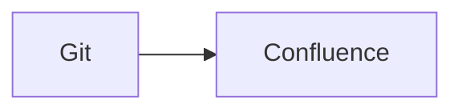

import ComposeBlock from '@site/src/components/ComposeBlock';
import {ArchitectureDiagram} from '@site/src/components/DataFlow';

# Example documentation

Read the [Starlark reference](/reference/starlark/).

See the [workflow section](/reference/starlark/#workflow).

Open the [filtered reference](/reference/starlark/?view=full).

See the [generated content](#generated-content).

Download the [relative artifact](artifacts/example.zip).

Download from the [CDN](//cdn.example/file.zip).

Download the [example configuration](/downloads/example.yaml).

:::note[Generated content]
This content is published from Docusaurus.
:::

| Item | Value |
| --- | --- |
| Source | Git |



```bash title="Run docusynx"
docusynx validate
```

<ComposeBlock />

<ArchitectureDiagram alt="Example architecture" />
